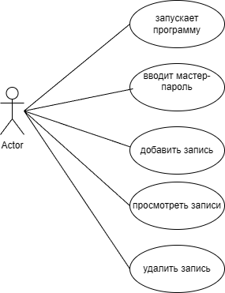
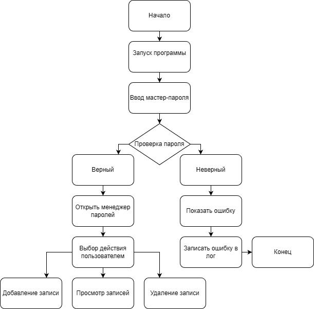

# secure-password-manager1
Secure password manager with GUI, master password protection and local storage (Python, Tkinter)
# 🔐 Secure Password Manager

## 📌 Описание проекта

**Secure Password Manager** — это десктопное приложение с графическим интерфейсом для хранения логинов и паролей. Доступ к данным защищён мастер-паролем.

Программа позволяет удобно управлять учётными данными и предотвращает их потерю или хранение в небезопасных местах.

---

## 🎯 Актуальность

В современном мире пользователи имеют множество аккаунтов и паролей. Часто пароли хранятся небезопасно (в заметках, браузере или в памяти), что повышает риск утечки данных.

Данный проект демонстрирует способ централизованного и более безопасного хранения паролей с использованием мастер-пароля.

---

## 👤 Целевая аудитория

* пользователи персональных компьютеров
* студенты
* люди, работающие с аккаунтами и сервисами

---

## 🎯 Цель проекта

Создать приложение с графическим интерфейсом для безопасного хранения паролей с использованием мастер-пароля.

---

## 🛠 Задачи проекта

* реализовать вход по мастер-паролю
* реализовать добавление записей
* реализовать просмотр записей
* реализовать удаление записей
* реализовать сохранение данных в файл
* реализовать логирование действий

---

## ⚙️ Функционал

Программа предоставляет следующие возможности:

* 🔑 вход по мастер-паролю
* ➕ добавление записей (сайт, логин, пароль)
* 📜 просмотр сохранённых данных
* ❌ удаление записей
* 💾 сохранение в файл
* 📊 ведение истории действий

---

## 🧩 Use Case диаграмма

Диаграмма показывает, как пользователь взаимодействует с системой: выполняет вход, добавляет записи, просматривает и удаляет данные.



---

## 🔀 Блок-схема алгоритма

Диаграмма отражает логику работы программы: проверку мастер-пароля и выполнение действий с данными.



---

## 🖥 Интерфейс программы

Приложение состоит из двух окон:

**Окно входа:**

* ввод мастер-пароля
* кнопка входа

**Основное окно:**

* поля ввода (сайт, логин, пароль)
* кнопки управления
* список сохранённых записей

---

## 📂 Структура проекта

```text
secure-password-manager/
│
├── main.py
├── README.md
├── passwords.txt
├── master.hash
├── log.txt
└── schema/
    ├── use_case.png
    └── flowchart.png
```

---

## ▶️ Как запустить программу

1. Установить Python 3
2. Скачать или клонировать проект
3. Запустить:

```bash
python main.py
```

---

## 🔐 Как работает мастер-пароль

При первом запуске создаётся мастер-пароль (по умолчанию: **admin123**).
Он сохраняется в виде хеша в файл `master.hash`.

При входе введённый пароль сравнивается с сохранённым хешем.
Доступ к данным предоставляется только при правильном вводе.

---

## 🧪 Пример работы

**Добавление записи:**

```text
site: vk.com | login: user123 | password: qwerty
```

**Отображение в программе:**

```text
1. Сайт: vk.com
   Логин: user123
   Пароль: qwerty
```

---

## 📜 Пример логов

```text
02.04.2026 22:10 - Успешный вход в программу
02.04.2026 22:12 - Добавлена запись для сайта vk.com
02.04.2026 22:15 - Удалена запись для сайта gmail.com
```

---

## 🔐 Принцип работы

Программа использует:

* хеширование пароля с помощью SHA-256
* локальное хранение данных
* проверку доступа через мастер-пароль

---

## ❗ Ограничения

Данная реализация является учебной и не предназначена для промышленного использования.
Пароли хранятся в открытом виде в файле и используются только для демонстрации.

---

## 📌 Вывод

В ходе выполнения проекта было разработано приложение для хранения паролей с графическим интерфейсом.

Программа демонстрирует:

* работу с Tkinter
* работу с файлами
* основы кибербезопасности
* организацию пользовательского интерфейса

Проект может быть расширен:

* шифрованием файла с паролями
* генератором паролей
* функцией смены мастер-пароля
* улучшением интерфейса

---
